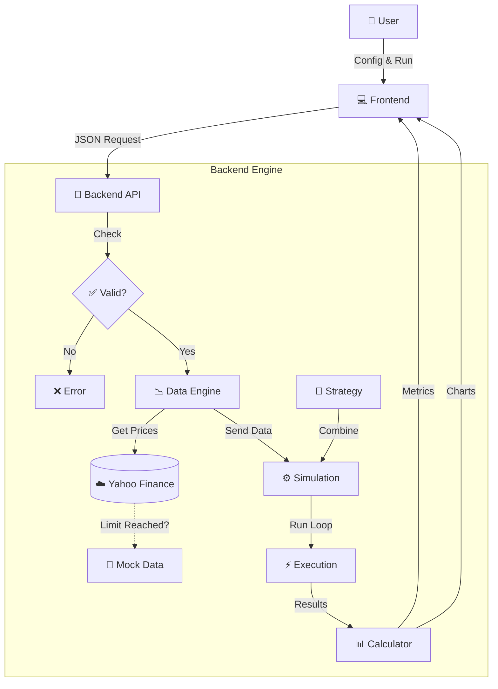

# 📈 Algorithmic Trading Strategy Simulator

   

**A professional-grade backtesting engine for quantitative strategy evaluation.**

This platform allows developers and traders to **simulate**, **analyze**, and **validate** trading strategies against historical market data without financial risk. It bridges the gap between theoretical models and realistic execution.

---

## 🧩 How It Works

The system simulates trading bar-by-bar, just like real life.



---

## 🚀 Key Features

*   **⚡ Event-Driven Backtesting**: Simulates trading bar-by-bar to model real-world execution.
*   **🛡️ Risk-First Metrics**: Calculates **Sharpe Ratio**, **Max Drawdown**, **Volatility**, and **Win Rate**.
*   **📉 Realistic Simulation**: Includes configurable **Slippage** and **Transaction Costs**.
*   **📊 Interactive Visualization**: Dynamic charts for Equity Curves, Price Actions, and Trade Entry/Exits.
*   **🧠 Modular Strategies**: Plug-and-play architecture for **Trend**, **Mean Reversion**, and **Momentum** strategies.

---

## 🛠️ Tech Stack

| Component | Technology | Role |
| :--- | :--- | :--- |
| **Backend** | 🐍 **Python 3.12** | Core Logic & orchestration |
| **Framework** | 🚀 **FastAPI** | High-performance Async API |
| **Engine** | ⚙️ **Backtrader** | Event-driven simulation framework |
| **Data** | 📉 **Pandas / yfinance** | Data ingestion & analysis |
| **Frontend** | ⚛️ **React 18** | Interactive Dashboard |
| **Styling** | 🎨 **Tailwind CSS** | Modern, responsive UI |
| **Charts** | 📈 **Recharts** | Data visualization |

---

## ⚡ Quick Start Guide

### 1️⃣ Backend Setup
```bash
cd backend
pip install -r requirements.txt
uvicorn backend.app.main:app --reload
# Server starts at http://localhost:8000
```

### 2️⃣ Frontend Setup
```bash
cd frontend
npm install
npm run dev
# Dashboard starts at http://localhost:5173
```

### 3️⃣ Run a Simulation
1.  Open **http://localhost:5173**.
2.  Select a **Ticker** (e.g., `AAPL`).
3.  Choose a **Strategy** (e.g., `RSI Mean Reversion`).
4.  Click **Run Backtest** 🚀.

---

## 🧪 Verification & Philosophy

This project strictly adheres to a philosophy of **Graceful Degradation**:

*   ✅ **Robustness**: The system handles insufficient data or invalid parameters without crashing.
*   ✅ **Sanitization**: API responses are scrubbed of `NaN` or `Infinity` values to protect the UI.
*   ✅ **Accuracy**: Benchmarked against a "Buy & Hold" baseline to prove strategy alpha.

---

## ⚖️ Limitations

*   **No Live Trading**: This is a research tool, not an execution bot.
*   **Daily Granularity**: Simulations run on Daily (1D) candles.
*   **Survivorship Bias**: Delisted companies are not automatically filtered.

---

## 📂 Project Structure

```text
├── 📂 backend
│   ├── 📂 app
│   │   ├── 📂 api          # Endpoints & Schemas
│   │   ├── 📂 engine       # Backtrader Wrapper & Execution
│   │   ├── 📂 strategies   # Strategy Logic Plugins
│   │   └── 📂 data         # Market Data & Mock Generator
├── 📂 frontend
│   ├── 📂 src
│   │   ├── 📂 components   # Recharts & UI Components
│   │   └── 📂 services     # Axios API Layer
├── 📄 README.md            # You are here
└── 📄 LIMITATIONS.md       # Detailed constraints
```

---

_Built for the **Advanced Agentic Coding** evaluation._
